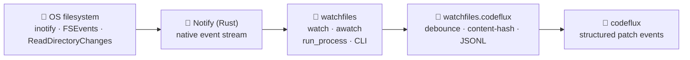

<div align="right">

[](https://github.com/toxicwind/codeflux-watchfiles)
[](https://pypi.org/project/watchfiles/)
[](https://anaconda.org/conda-forge/watchfiles)
[](https://github.com/toxicwind/codeflux-watchfiles/blob/main/LICENSE)
[](https://github.com/notify-rs/notify)
[](https://github.com/toxicwind/codeflux)

</div>

# watchfiles

### Simple, modern, high-performance file watching — and code reload — in Python.

Filesystem notifications are handled by the [Notify](https://github.com/notify-rs/notify) Rust library, so you get native OS events instead of polling loops. This package was previously named "watchgod" — see [the migration guide](https://watchfiles.helpmanual.io/migrating/).

> 🧬 **toxicwind fork** — our working fork of [samuelcolvin/watchfiles](https://github.com/samuelcolvin/watchfiles), adding **`watchfiles.codeflux`**: structured file events — debounced, content-hashed, emitted as JSONL — purpose-built for the [codeflux](https://github.com/toxicwind/codeflux) live patch-streaming pipeline.

📚 **Documentation**: [watchfiles.helpmanual.io](https://watchfiles.helpmanual.io) · 💻 **Upstream source**: [github.com/samuelcolvin/watchfiles](https://github.com/samuelcolvin/watchfiles)

---

## ✨ Features

- **Native file events** — Rust-powered notifications via Notify, not polling
- **Sync + async APIs** — `watch` / `awatch` generators for change streams
- **Process management** — `run_process` / `arun_process`: restart code on change
- **CLI** — `watchfiles "some command" src` for instant live-reload workflows
- **`watchfiles.codeflux`** *(fork addition)* — structured, debounced, content-hashed file events as JSONL: the watcher stage of the codeflux pipeline

---

## 🚀 Quick start

```bash
# 1. install (binaries for most platforms; needs Python 3.10–3.15)
pip install watchfiles

# 2. watch a directory
python -c "
from watchfiles import watch
for changes in watch('./src'):
    print(changes)
"

# 3. or live-reload a command from the CLI
watchfiles "pytest -x" src
```

---

## 🔧 Architecture



### Usage

**`watch`** — synchronous change stream:

```py
from watchfiles import watch

for changes in watch('./path/to/dir'):
    print(changes)
```

See [`watch` docs](https://watchfiles.helpmanual.io/api/watch/#watchfiles.watch).

**`awatch`** — async change stream:

```py
import asyncio
from watchfiles import awatch

async def main():
    async for changes in awatch('/path/to/dir'):
        print(changes)

asyncio.run(main())
```

See [`awatch` docs](https://watchfiles.helpmanual.io/api/watch/#watchfiles.awatch).

**`run_process`** — restart a target on change:

```py
from watchfiles import run_process

def foobar(a, b, c):
    ...

if __name__ == '__main__':
    run_process('./path/to/dir', target=foobar, args=(1, 2, 3))
```

See [`run_process` docs](https://watchfiles.helpmanual.io/api/run_process/#watchfiles.run_process). (`arun_process` is the async twin.)

### CLI

```bash
watchfiles "some command" src   # run `some command` when files in src change
watchfiles --help
```

Full CLI reference: [the CLI docs](https://watchfiles.helpmanual.io/cli/).

---

## ⚙️ Config

**watchfiles** requires Python 3.10–3.15. Binaries ship for most architectures on Linux, macOS and Windows ([details](https://watchfiles.helpmanual.io/#installation)); install from source requires stable Rust.

Optional services: none. Pure library + CLI, no daemons, no keys.

---

## 🛠️ Dev

```bash
make test        # or see the Makefile for lint/typecheck targets
pytest tests/
```

Contributions welcome — upstream-compatible changes stay upstream-shaped; the `codeflux` structured-event surface is this fork's lane. Full dev docs: [watchfiles.helpmanual.io](https://watchfiles.helpmanual.io).

---

## 🧬 The codeflux family

| Repo | Role |
|---|---|
| [**codeflux**](https://github.com/toxicwind/codeflux) | the live streaming pipeline |
| [**codeflux-moulti**](https://github.com/toxicwind/codeflux-moulti) | TUI steps + `stream` subcommand |
| [**codeflux-patchling**](https://github.com/toxicwind/codeflux-patchling) | deterministic mutation backend |
| [**codeflux-python-patch**](https://github.com/toxicwind/codeflux-python-patch) | hunks-as-data + apply reports |
| [**codeflux-watchfiles**](https://github.com/toxicwind/codeflux-watchfiles) | structured file events (this repo) |

---

## 📄 License & security

**License:** [MIT](LICENSE) — © 2017 to present Samuel Colvin. Forked with gratitude; fork additions © toxicwind under the same terms.

**Security:** this is a local file-watching library with no network surface. Report issues privately via GitHub Security Advisories on this repo.
